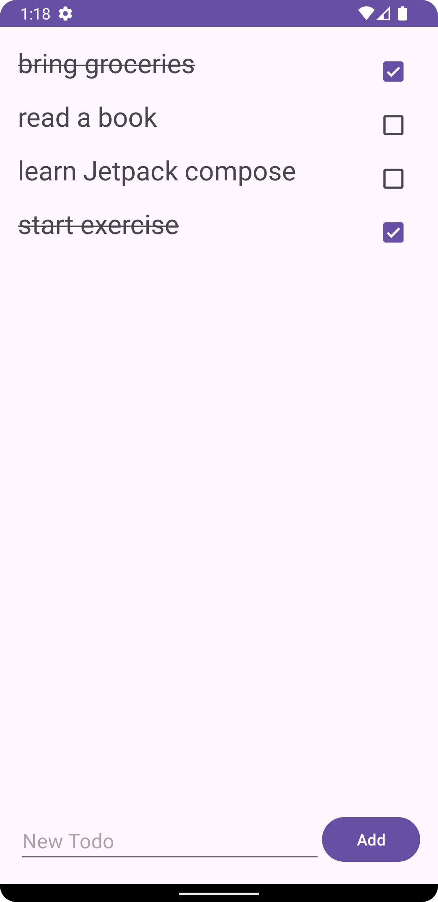

# Todo Android App

A simple yet powerful Todo application for Android that persists data using Room Database. Manage tasks efficiently with intuitive swipe gestures and real-time updates.

## Features

- **Persistent Storage**: Todos saved in SQLite using Room
- **Interactive Checklist**: Mark tasks complete with checkboxes
- **Swipe-to-Delete**: Remove items with left/right swipe
- **Real-time Sync**: LiveData-driven UI updates
- **Visual Feedback**: Strike-through effect for completed items
- **Clean Architecture**: MVVM pattern implementation
- **Efficient Rendering**: DiffUtil optimized RecyclerView

## Tech Stack

- **Room** - Data persistence
- **LiveData** - Observable data holder
- **ViewModel** - Lifecycle-aware data management
- **RecyclerView** - Dynamic list display
- **DiffUtil** - Smart list updates
- **Coroutines** - Asynchronous operations

## Usage

1. **Add Task**  
   Type in the text field and tap the add button

2. **Mark Complete**  
   Check the box to toggle completion state

3. **Delete Task**  
   Swipe item left/right to remove permanently

